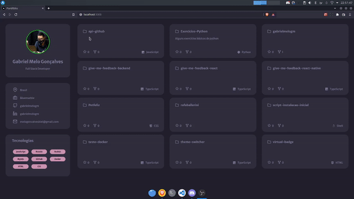

<div align="center">
  <h1>My portfolio</h1>
  
</div>

Like all good people, creating my own portfolio could not be missing from my personal projects.

## HOW TO STARTING
- Create file <code>.env</code> in project root
- Put your github user in the <code>.env</code> file
```js
NEXT_PUBLIC_GITHUB_USER=gabrielmelogm
```

## HOW TO RUN
```bash
yarn dev
```
